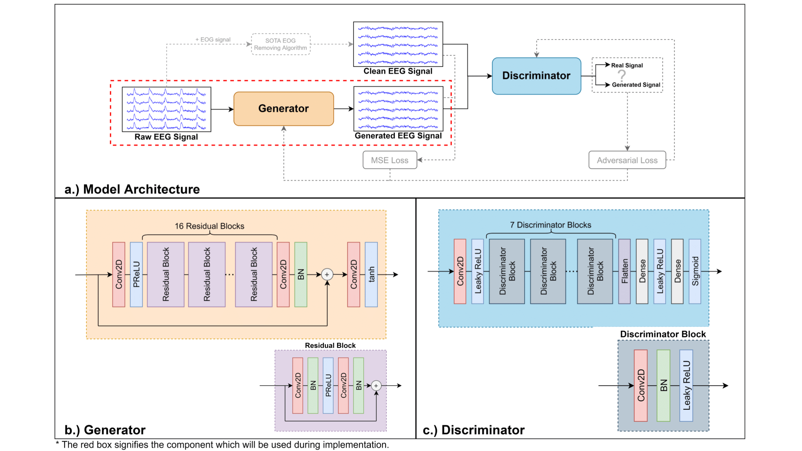
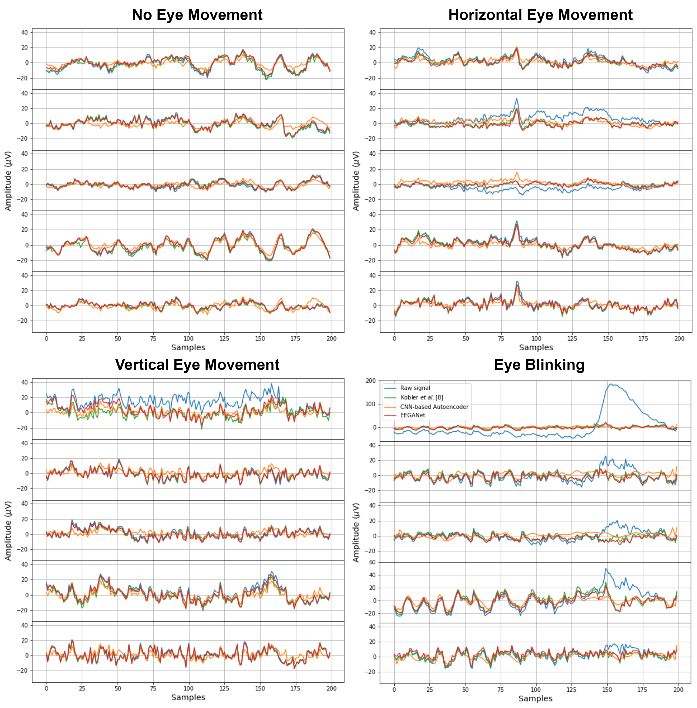

# EEGANet: Removal of Ocular Artifact from the EEG Signal Using Generative Adversarial Networks
## This work is published at IEEE Journal of Biomedical and Health Informatics

## Abstract

**The elimination of ocular artifacts is critical in analyzing electroencephalography (EEG) data for various brain-computer interface (BCI) applications. Despite numerous promising solutions, electrooculography (EOG) recording or an eye-blink detection algorithm is required for the majority of artifact removal algorithms. This reliance can hinder the model's implementation in real-world applications. This paper proposes EEGANet, a framework based on generative adversarial networks (GANs), to address this issue as a data-driven assistive tool for ocular artifacts removal. After the model was trained, the removal of ocular artifacts could be applied calibration-free without relying on the EOG channels or the eye blink detection algorithms. First, we tested EEGANet's ability to generate multi-channel EEG signals, artifacts removal performance, and robustness using the EEG eye artifact dataset, which contains a significant degree of data fluctuation. According to the results, EEGANet is comparable to state-of-the-art approaches that utilize EOG channels for artifact removal. Moreover, we demonstrated the effectiveness of EEGANet in BCI applications utilizing two distinct datasets under inter-day and subject-independent schemes. Despite the absence of EOG signals, the classification performance of the signals processed by EEGANet is equivalent to that of traditional baseline methods. This study demonstrates the potential for further use of GANs as a data-driven artifact removal technique for any multivariate time-series bio-signal, which might be a valuable step towards building next-generation healthcare technology.**

## Model Architecture
<p align='center'>

</p>

## Datasets
### 1.[EEG eye artifact dataset](https://github.com/rkobler/eyeartifactcorrection).
- study01: 5 participants, 200 Hz sampling frequency, and 62 EEG channels.
- study02: 15 participants, 200 Hz sampling frequency, and 68 EEG channels.
- study03: 10 participants, 200 Hz sampling frequency, and 68 EEG channels.
- study04: 15 participants, 100 Hz sampling frequency, and 65 EEG channels.
- study05: 14 participants, 256 Hz sampling frequency, and 62 EEG channels.
### 2.[BCI Competition IV 2b](http://bnci-horizon-2020.eu/database/data-sets) (4. Two class motor imagery (004-2014).
- 9 participants, 250 Hz sampling frequency, and 3 EEG channels.
### 3.[Multimodal signal dataset](http://gigadb.org/dataset/100788).
- 25 participants, 2500 Hz sampling frequency, and 60 EEG channels.

## Results
<p align='center'>

</p>

Any enquiry can be sent to phattarapong.saw@gmail.com

## Dependencies
- Python ==3.8.2
- tensorflow-gpu ==2.2.0
## Citation
To cite [our paper](https://ieeexplore.ieee.org/document/9627782),
```
@article{sawangjai2021eeganet,
  title={EEGANet: removal of ocular artifact from the EEG signal using generative adversarial networks},
  author={Sawangjai, Phattarapong and Trakulruangroj, Manatsanan and Boonnag, Chiraphat and Piriyajitakonkij, Maytus and Tripathy, Rajesh Kumar and Sudhawiyangkul, Thapanun and Wilaiprasitporn, Theerawit},
  journal={IEEE Journal of Biomedical and Health Informatics},
  year={2021},
  publisher={IEEE}
}
```